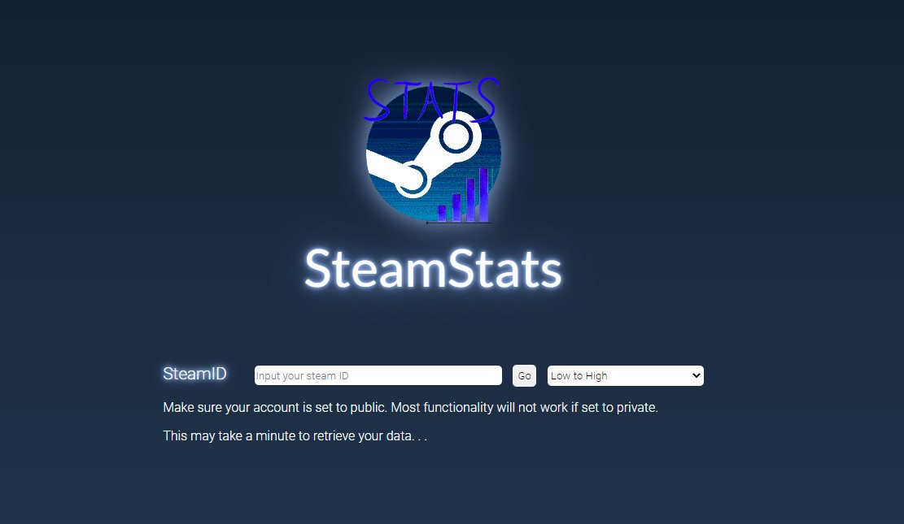
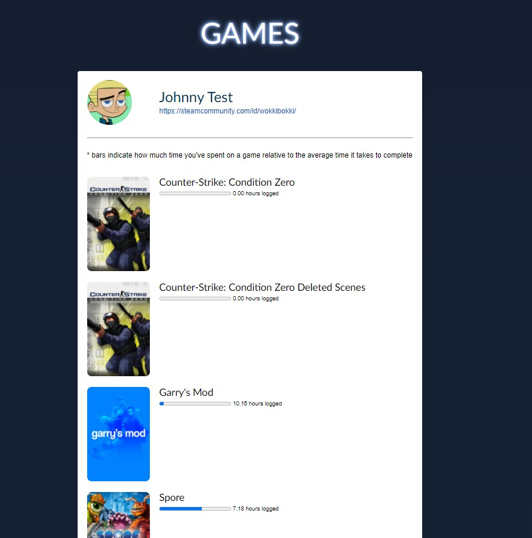

# Hack-the-North-2021
Group Submission for Hack the North 2021 - Nick, Kelvin, Christine, Charles

## Inspiration
We like games. 
## What it does
Find your steam id and make sure your account is set to public. Put it in. Wait for a bit, because we made it kind of slow, and then voila. You can see your game hours compared to the [average completion time](https://howlongtobeat.com/). 
## How we built it
We pulled some information from the Steam API and howlongtobeat API. We used Flask for some basic routing and templating. CSS and HTML for the front end.
## Challenges we ran into
A lot. We struggled with implementing our original idea using another API that required OpenID and OAuth. The documentation was very confusing for newcomers. We spent a bulk of our time trying to figure out how to access these web APIs and ultimately decided to move on and use something easier to implement. We also stripped down a lot of our planned functionality in the interest of time. We also ran into issues dealing with asynchronous functions and rendering in Flask so we had to scrap an idea.
## Accomplishments that we're proud of
We implemented a merge sorting algorithm and implemented it into our front-end. This organized our displayed information. We are also really proud of how much we came up with considering we swapped ideas a couple times into the hackathon. What we were left with is pretty ok. All of our developers are pretty new with only one semester of computing education. Our front-end, even though not mobile-responsive has a pretty cool aesthetic. And Chad Charles made a chad logo.
## What we learned
Planning is necessary. Organization in a small team and delegating tasks is more important than we thought. At the same time, flexibility is crucial when you run into unexpected challenges. We got more familiar working with APIs and a framework. We also learned our limitations and what we need to improve on. 

## What's next for SteamStats
There's a lot to improve. The function that grabs user info takes a couple minutes to load. That's a long time... Our front-end is not responsive. We don't have a loading page while the user is waiting during those two minutes. Our webapp is also pretty rudimentary, only having one real feature. We could implement more info and stats for the user. Our webapp is also not deployed, so we could look into Netlify, AWS, etc. 
